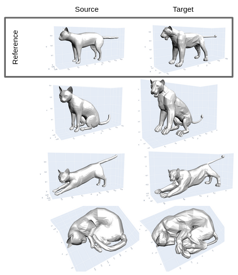
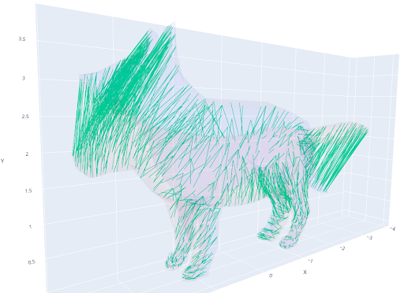
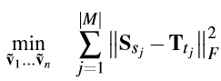

# Implementation: "Deformation Transfer for Triangle Meshes"

Python implementation of the paper ["Deformation Transfer for Triangle Meshes" by Sumner, Popović](http://people.csail.mit.edu/sumner/research/deftransfer/Sumner2004DTF.pdf) with 3D views in the browser.

 

## TL; DR

The goal is to transfer animations (deformations) from one model (source) to any other model (target) which does not share the same vertices count.

The core idea is to describe the linear problems as **position-independent triangle transformations** (triangle span + normal).

First a **correspondence mapping** between the source and target reference models is created by **progressively "inflating"** the source shape into the target shape. Each step **minimizes the cost of the triangle transformation** of the source mesh while **pinning the user-provided marker vertices to the target mesh**.
Iteratively **closest points** are selected and increasingly weighted in the cost function.

The **deformation transfer** is the **minimum solution** of the **Frobenius distance** between the triangle transformations `(source🠊deformed-source, target🠊deformed-target)` for each mapped triangle pairs.

> - "Pinning": The markers are already solved and moved to the right side of `Ax=b`.
> - "Frobenius norm": Very useful matrix norm that is invariant to matrix equation rearrangements.

## Examples

There are **online interactive renders** at: https://mickare.github.io/Deformation-Transfer-for-Triangle-Meshes/

## How it works

1. Build correspondence mapping
    1. Iterate n number of times:
        1. Solve minimum cost of the source mesh transformation with the markers pinned to the target mesh
        
           - *ES*: Smoothness cost, *EI*: Identity cost, *EC*: Clostest-point cost
        2. Find closest point on target mesh for each source vertice
        3. Increase weight *wC* of closest-point cost function
    2. Find matching triangles via triangle centroids and orientation
   
2. Transfer deformation
    - Solve minimum of the Frobenius distance between the transformations of source to deformed source and of the target to the unknown deformed target.
    
      - *M*: mappings, *SSj*: j'th triangle transformation of source, *Ttj*: j'th triangle transformation of target, *&tilde;v*: vertices of the deformed target 
    - The deformed target is the objective of the minimization.

## Requirements

Python >= 3.9

Pip-Requirements:
- `pip install -r requirements.txt`

## Usage

Each part of the `.py` files can be run by themself to visualize the results of each component.

For simplification none accepts command arguments. 
You'll have to modify the "main" yourself to change for example the used model.

File | Description | Main
-|-|-
`correspondence.py` | Create the correspondence mapping. | Will plot each step of the correspondence.
`transformation.py` | Use a mapping to transfer a deformation | Will plot the result of the transformation
`animation.py` | | Plots an animation for all deformations for a model.
`export.py` | | Exports each step of correspondence, transformation and the animation to a html page.
`config.py` | Default configuration and file paths to markers and models. |

### Helper

File | Main
-|-|-
`render/plot_marker.py` | Plots the markers for two models.

# License
The code in this repository is licensed under the [MIT License](LICENSE).

The models are each licensed from a third party and are not part of this license!
You should NOT distribute or use these models against their license.
A list of the used model licenses and source is under [models/](models/).
